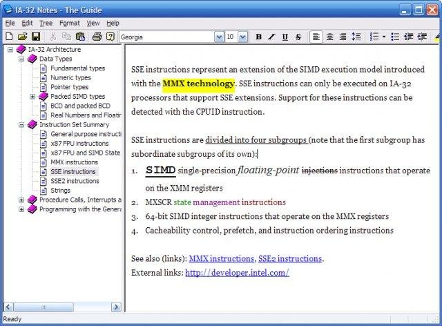

# Non-Windows The Guide library

This is a fork of the orignal Windows-only `libguide`, part of the awesome [The Guide](https://theguide.sourceforge.net/index.html) hierarchical note application.

## 📘 About The Guide

>The Guide is an application that allows you create documents ("guides") which inherently have a tree (which you can modify as you please) and text associated with each node of the tree. The text itself is of the rich-text variety, and the editor allows you to modify the style and formatting of the text (fonts, bold, italics etc).

>The Guide is a 32-bit native C++ Win32 application (that uses MFC). It will work on 64-bit platforms also.



The Guide stores notes in a `.gde` file, which is a binary file that contains a tree of nodes and their attributes (e.g. icon). Every node can have RTF formatted text (a note) as payload.

Development on the last released original The Guide version (2.0) seems to have stopped completely in 2008. Last [blog post](http://buildingtheguide.blogspot.com/) is from 2010. It looks like at the time, version 3.0 was in development:

>As we build the application on the Qt framework, we can install V3 no only on Windows, but Linux and Mac as well. The first two have our active attention, for Mac there is a vacancy.

But this cross platform version has never been released sadly.

### The Guide's Licence

```
The Guide is developed and distributed under the "Apache License 2.0",
an OSI-approved open source license. For full license text, please see
the file named "LICENSE", or http://www.apache.org/licenses/LICENSE-2.0.
```

## About this fork

This is a fork of `libguide` and `gdeutil` from the original 2.0 sources.

- `libguide` is the part of The Guide source code that contains the engine behind the main program. 
With the library you can load, manipulate and write The Guide V2 files.
- `gdeutil` is a command line utility that can convert `gde` files to XML.

While written in C, the orignal `libguide` and `gdeutil` use several Windows specific APIs, and therefore does not compile on non-Windows systems.
The code in this fork is modified to work on macOS and possibly other Posix compatible systems (not tested).


Most notable changes from the original `libguide`:

- Use `mmap` instead of `CreateFileMapping`/`MapViewOfFile` for memory mapped files.
- Use Posix unicode functions like `mbsrtowcs`, instead of Windows specific ones, like `MultiByteToWideChar`.
- Removed `wintree.c`, `wintree.h`. These are specific for Windows TreeView components, and hence not usable on non-Windows systems.
- Use Makefile instead of Visual Studio project.
- Applied fix to read `.gde` files on different architecture than it was created.
- Removed support for v1 gde files; this fork only supports v2.

## Building

    $ make

Debug build:

    $  make DEBUG=1
    
## Using

The original library is not documented, but the code is pretty readable.
With the help of the header files you should be able to use library fairy quickly

There is also a `test` directory, with some example code.

## Known issues/todo

In general: this library is not well tested. 

It has been mainly tried out with some old `.gde` files I still had. Your mileage may vary with other files.

Specific issues worth mentioning:

- When loading a file with `guide_load()`, you need to manually provide (as an argument) the architecture on which the file was created. This is error prone. TODO: find a way to determine architecture automatically.
- Currently, `gdeutil` is hardcoded to work only with 32-bit `gde` files. TODO: add switch to make this dynamic.
- Unicode handling (`convert_to_utf8`, `convert_to_unicode_from_usercp`) not well tested, and probably does not handle all use cases wel.

## Fine print

This code is provided "as is" without warranty or support of any kind.
Use this library as reference, to play around with, etc., but not for anything serious.

## QA

Q: Why did you make this? It's totally unnecessary.

A: I felt nostalgic when I encoutered my old The Guide files.

Q: Does it work?

A: Kind of. Seems to work for my use cases. Feel free to fork and improve.


